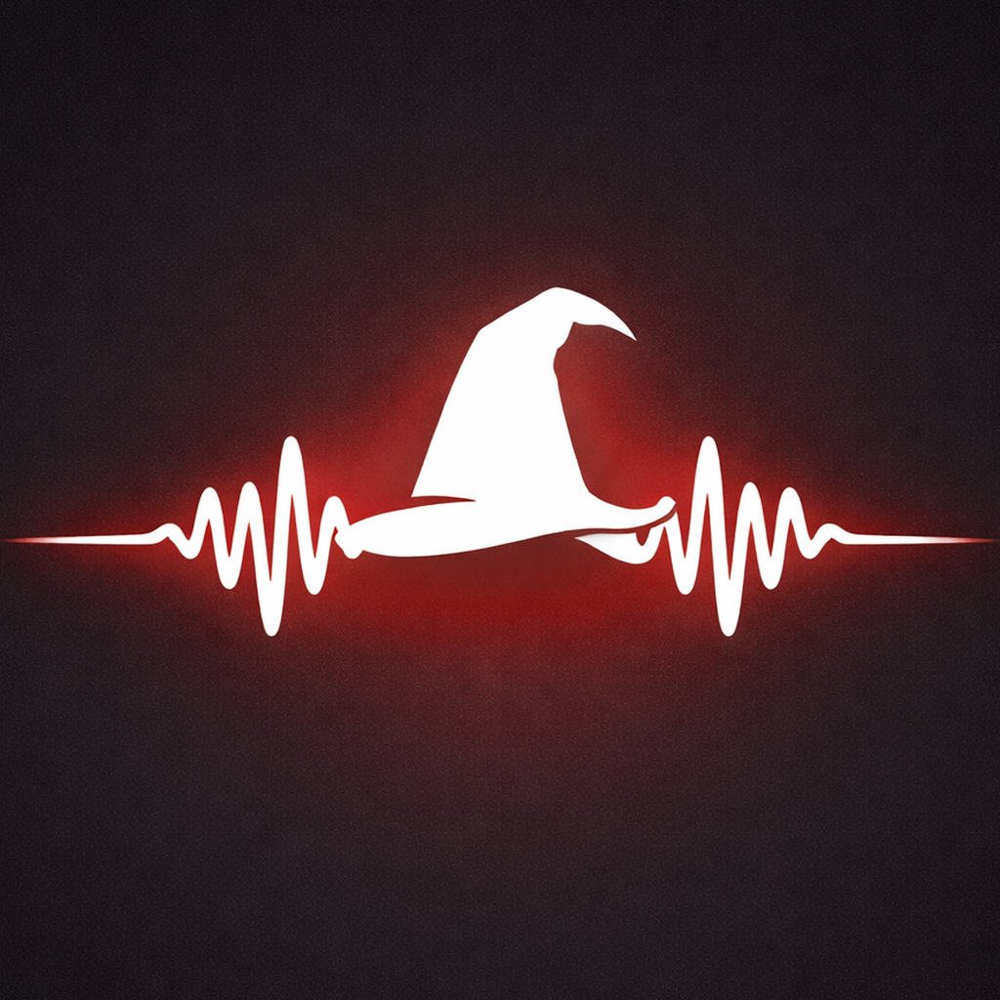

<p align="center">
  
</p>

<h1 align="center">VoxWzrd</h1>

<p align="center">
  Meeting assistant for iOS and macOS — record, transcribe, and summarize meetings with on-device or cloud AI.
</p>

---

## What is VoxWzrd?

VoxWzrd records meetings, transcribes them with on-device or cloud speech-to-text, generates AI summaries, and extracts action items. It's a native SwiftUI app for iPhone, iPad, and Mac, with a macOS menu bar utility for quick capture.

Privacy is a first-class feature: on-device processing is the default, cloud AI is opt-in.

## Features

- **One-tap recording** — microphone on iOS/macOS, system audio capture on macOS (Zoom, Teams, Meet), or mixed-mode
- **On-device transcription** — WhisperKit via Core ML with selectable model sizes (base, small, large)
- **Cloud transcription** — OpenAI Whisper Large v3 via serverless backend for higher accuracy
- **Multi-provider AI summaries** — OpenAI, Anthropic, Google Gemini, Ollama, or custom endpoints
- **Action item extraction** — assignees and due dates detected automatically
- **Speaker diarization** — energy-based speaker identification
- **Full-text search** — SQLite FTS5 across all meetings and transcripts
- **Export** — Markdown, PDF, clipboard, Reminders (via EventKit)
- **iCloud sync** — metadata syncs across devices, audio stays local
- **macOS menu bar** — quick-access recording and last summary
- **iOS Share Extension** — import audio files from other apps
- **Audio import** — WAV, M4A, MP3, CAF

## Install (macOS)

### Homebrew (recommended)

```
brew install --cask brndnsvr/tap/voxwzrd
```

That's it — the cask downloads the signed, notarized DMG and installs VoxWzrd.app to `/Applications`.

To update later:

```
brew upgrade --cask brndnsvr/tap/voxwzrd
```

### Direct download

Grab the latest `VoxWzrd-vX.Y.Z.dmg` from the [releases page](https://github.com/brndnsvr/VoxWzrd-releases/releases), open it, and drag VoxWzrd to Applications.

### Requirements

- macOS 14.0 or later (Apple Silicon required for on-device ML)
- Microphone access (for recording)
- Screen Recording permission (only if you want to capture system audio from Zoom/Teams/Meet)

## Install (iOS / iPadOS)

iOS and iPadOS builds are distributed through TestFlight. The App Store release is planned but not yet live.

- iOS 17.0 or later
- iPhone or iPad on Apple Silicon or A-series chip capable of on-device ML

## Privacy

- On-device transcription is the default — audio never leaves the device unless you opt into cloud processing
- API keys for AI providers are stored in the macOS / iOS Keychain
- iCloud sync transfers only metadata; audio files remain local
- No analytics or telemetry

## Documentation

| Document | Description |
|----------|-------------|
| [BUILD.md](BUILD.md) | Build from source: Xcode setup, backend, deployment |
| [docs/architecture.md](docs/architecture.md) | System design, Mermaid diagrams, platform feature matrix |
| [docs/prd.md](docs/prd.md) | Product requirements, feature priorities, success metrics |
| [docs/handoff.md](docs/handoff.md) | Project onboarding and context |
| [Backend/README.md](Backend/README.md) | Backend service overview |
| [Backend/API.md](Backend/API.md) | REST API reference |

## License

Copyright © Brandon Seaver. All rights reserved.
